# UPDATES (current version: 1.9.1.2.4.4.1)

****

**Version 1.0 - 1.2 | Early September**
1. Created a footer with a simple no-background design.
2. Designed the main page with a perfectly centered paragraph.
3. Published the website on GitHub.
[https://mcqcat.github.io/MCAW_Project01/]

****

**Version 1.3 - 1.4 | Early-Mid-September**
1. Added a fixed header.
2. Switched designs from: 

    (1st version)
   
   to
   
   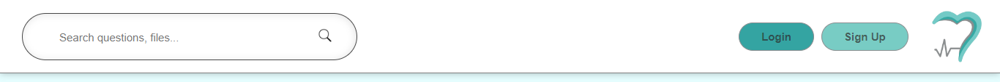 (2nd version)

3. Added README and LICENSE files. Applied Creative Commons Attribution-NonCommercial-NoDerivatives 4.0 International License.

****

**Version 1.5 - 1.6 | September 15-19**

1. Introduced a new header design (3rd version):
   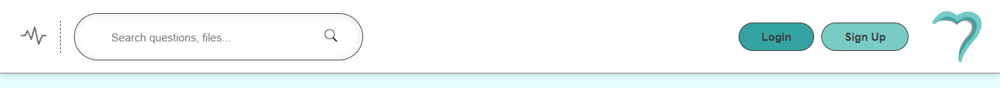

2. Updated the header design in preparation for the sidebar button and sidebar:

    (3rd version)

   
   to
   
    (4th version)

3. Created the new sidebar (1st version):

   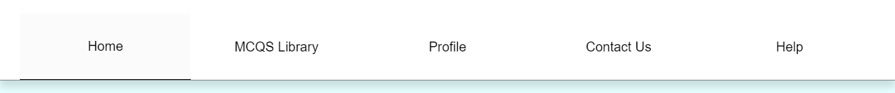

4. Made the NAV button (chart-line button) interactive with JavaScript and improved transition smoothness:

   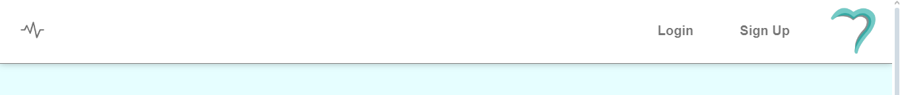
   
   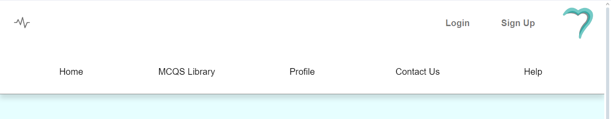

****
**Version 1.7 | September 19**

1. Troubleshooting and bug fixes: 

   - [UI fixes on iPhone and iPad] 

   - [Resizing issues related to the header on all devices] 

   - [Resizing issues related to the sidebar on all devices] 

2. Minor UI fixes and improvements.

3. Smoothing out the transitions 

4. Changed color scheme for the whole project.

****

**Version 1.8 | September 20-22**

1. Minor UI fixes and improvements.

2. Login page created (1st version), but not compatible with mobile.

   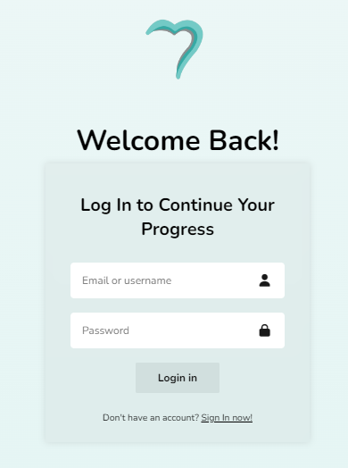

3. Updated login page with precise resizing and scrolling mechanics for all devices (2nd version).

   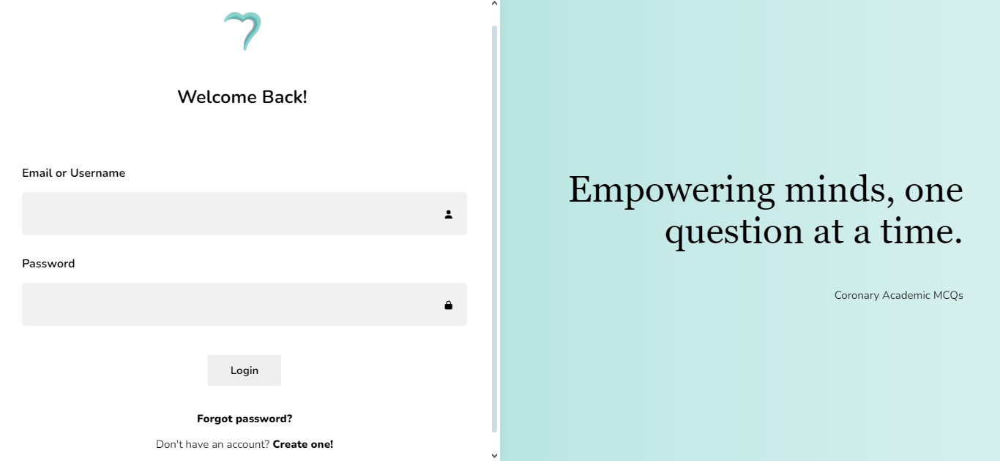

4. Show and hide button with an animated lock and unlock icon synced with the show and hide button on the login page.

5. Sign In page created (1st version), with warning messages for different rules.

   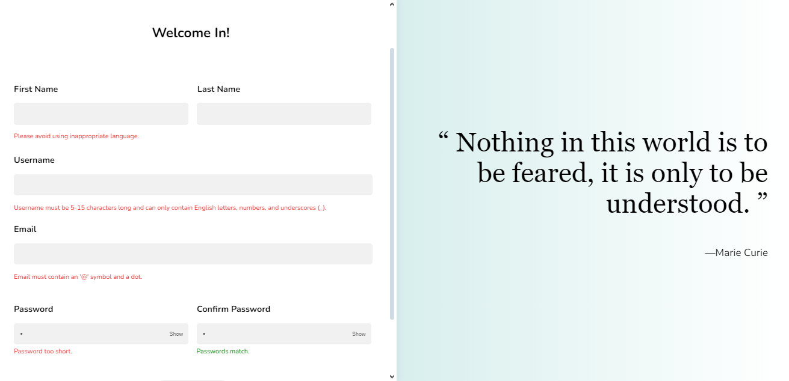

6. Translation service is now available (so far for the index page, but not other pages).

   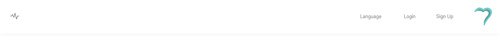
   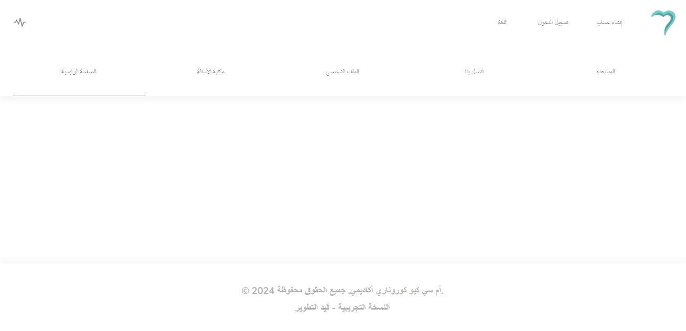
   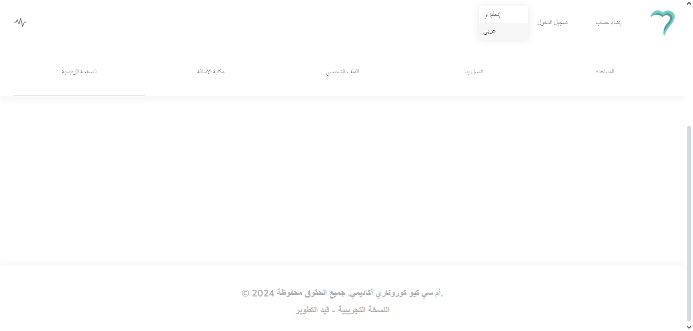

7. Updated Header (5th version) and logo animation on all pages

   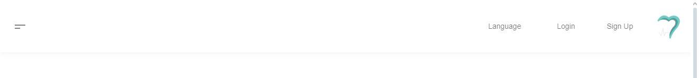
   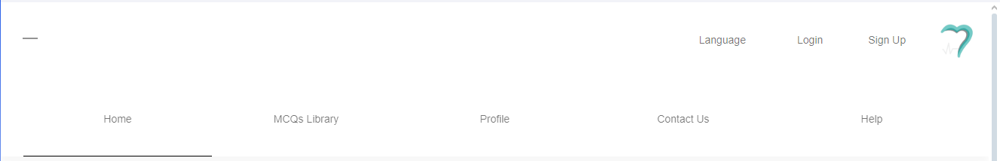
    
   

8. The small default title icon has been changed for the current logo of the website

****
**Version 1.9 | September 24-26**

1. Various issues and bugs have been fixed with the new content being prepared (so far, adding the Contact Us page)

2. More features and improved system management coming soon to enhance the entire site.

****