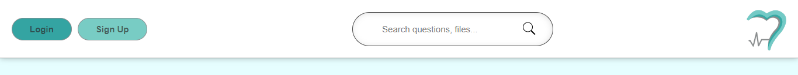
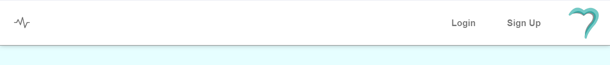

# UPDATES

****

**Version 1.0 - 1.2 | Early September**
1. Created a footer with a simple no-background design.
2. Designed the main page with a perfectly centered paragraph.
3. Published the website on GitHub.
[https://mcqcat.github.io/MCAW_Project01/]

****

**Version 1.3 - 1.4 | Early-Mid-September**
1. Added a fixed header.
2. Switched designs from: 

    (1st version)
   
   to
   
    (2nd version)

3. Added README and LICENSE files. Applied Creative Commons Attribution-NonCommercial-NoDerivatives 4.0 International License.

****

**Version 1.5 - 1.6 | September 15-19**

1. Introduced a new header design (3rd version):
   

2. Updated the header design in preparation for the sidebar button and sidebar:

    (3rd version)

   
   to
   
    (4th version)

3. Created the new sidebar (1st version):

   

4. Made the NAV button (chart-line button) interactive with JavaScript and improved transition smoothness:

   
   
   

****
**Version 1.7 | September 19**

1. Troubleshooting and bug fixes: 

   - [UI fixes on iPhone and iPad] 

   - [Resizing issues related to the header on all devices] 

   - [Resizing issues related to the sidebar on all devices] 

2. Minor UI fixes and improvements.

3. Smoothing out the transitions 

4. Changed color scheme for the whole project.

****

**Version 1.8 | September 20**

1. Minor UI fixes and improvements.

2. Login page created (1st version), but not compatible with mobile.

   

